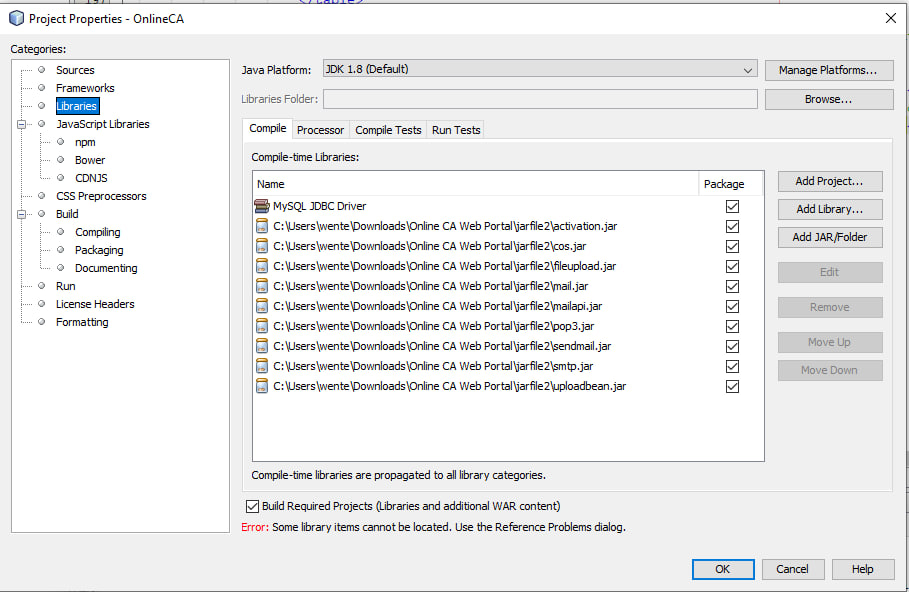
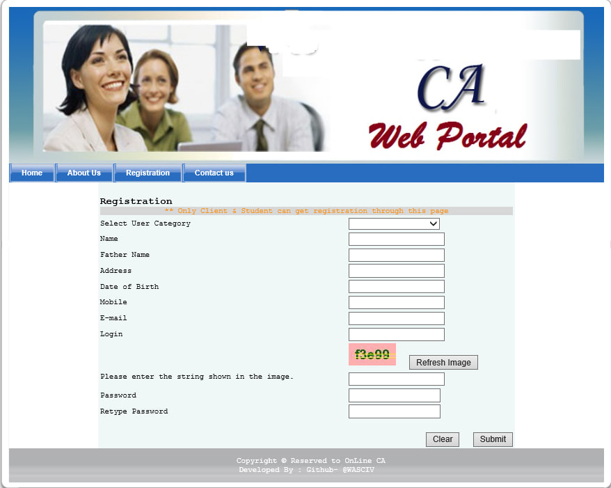
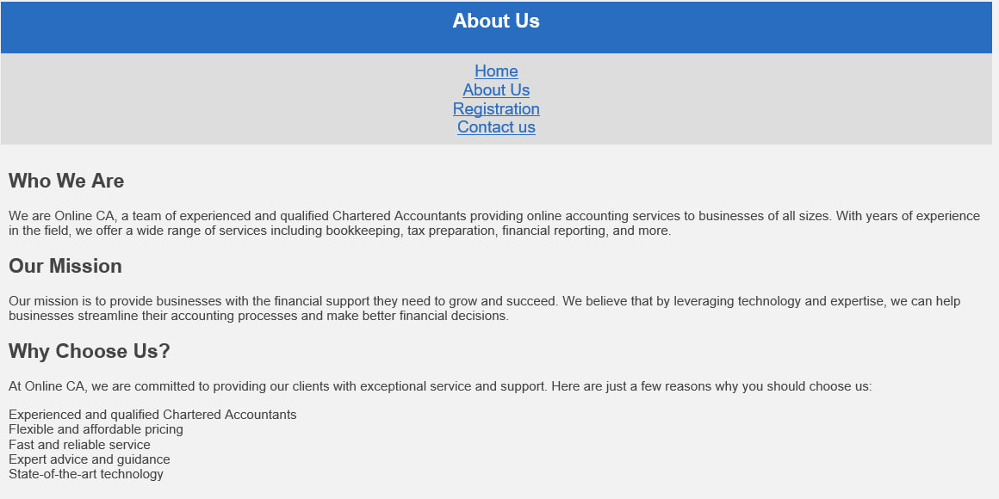
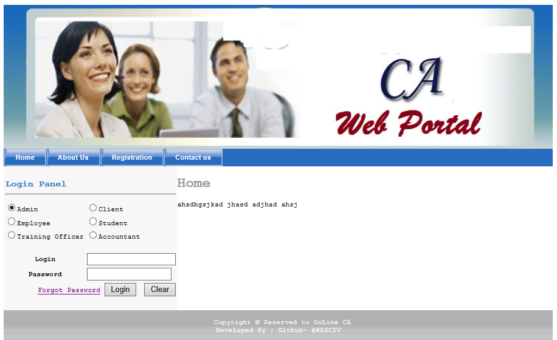

# Online CA Web Portal

Online CA Web Portal which i made in 2021 I'm just posting it just like this 

## How to use the this Portal in Windows ?

1. First Of make sure to install everything from JavaTools (https://drive.google.com/drive/folders/16qfiSm5G8_wc3iifEFR8Tbo5QnhLL__o?usp=share_link)

2. Then As mentioned in screenshot do the changes to the properties and make sure to Install Apache..You can only host on Localhost

3. It will only work on the version that is mentioned in JavaTools

4. Make sure to Follow steps correctly

## Video Tutorial On How to Use 

https://youtu.be/DIEspfqTqbI

## Screenshots

## Contributions

Contributions are welcome! If you find a bug or have a feature request, please open an issue on GitHub.

## License

This project is licensed under the [MIT License](https://github.com/WASCIV/Forevermail/blob/main/LICENSE).

## Follow me on Instagram

Don't forget to follow me on Instagram [@wasiqhatesinsta](https://www.instagram.com/wasiqhatesinsta/) for more projects and updates!

## Join Us On Telegram

Don't forget to follow me on Instagram [@forever_knightss](https://t.me/+iaTYOodcEuU3YjFl) for more projects and updates!
